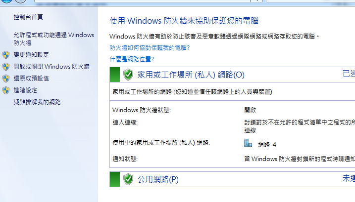

# IIS + Python3 + Flask

記錄 win7 下 IIS 配合 Python3 Flask的網站架設

----

## 安裝Python環境

- 一開始有參考的文章
    - [windows servier2008+virtualenv下部署Flask (IIS+wfastcgi)](https://www.cnblogs.com/liluping860122/p/9203908.html)


- 下載 python-3.7.4 並安裝(我是裝for all user, 並且裝在 C:\python37 的資料夾中，而不是在 program 下，避開有空白字元的路徑)
- 安裝virtualenv: `pip install virtualenv`
- 建virtualenv環境: 在c:\ 下 `virtualenv env_web` (不用應該也ok)
- 進到`env_web/Scripts`資料夾中, 下指令`activate.bat`
- 因為我的專案已有確定的 requirements.txt文件，所以進入專案資料夾中，執行 `pip install -r requirements.txt`，其內容如下：
    ```
    flask==1.0.2
    flask-cors==3.0.7
    gunicorn==19.9.0
    requests==2.21.0
    pymongo==3.7.2
    matplotlib==3.0.3
    APScheduler==3.6.1
    ```
- 可以用 `python app.py` 測試看看是否正常，我的預設為port5000，所以在chrome上輸入`http://localhost:5000/`即可看到網頁

- 安裝wfastcgi:  `pip install wfastcgi`，這個是全域的安裝，不是virtualenv中，所以先執行`deactivate`
- 再把 `C:\Python37\Lib\Site-packages`中的 `wfastcgi.py` 複製一份到你的專案資料夾中

----

## 安裝IIS

- 進 `控制台 / 程式集 / 開啟或關閉windows功能` ，點選 Internet Information Services，子項目勾選如下圖
    - 
    - 
- CGI的項目一定要勾選
    - 
- 其它的都我保留預設
    - 
    - 
    
- 按確認裝安到完，進 控制台 / 系統及安全性 點選 系統管理工具
    - 
    
- 進去後點開「IIS管理員」的項目，畫面如下：
    - 

- 在「站台」上點右鍵，點「新增網站」，設定如下：
    - 
    - 
- 到這邊我在IIS中port5000的網頁還無法執行
    - 

- 安裝「Microsoft Web Platform Installer」的「安裝URL重寫組件」
    - 這一項不確定是否真的要，因為我有安裝，但是沒有依照他的步驟全做
    - [參考文章](https://betacat.online/posts/2017-03-27/deploy-flask-to-iis/)
    - [安裝連結](https://www.microsoft.com/web/downloads/platform.aspx?ranMID=24542&ranEAID=je6NUbpObpQ&ranSiteID=je6NUbpObpQ-6ev1fyg4fHlVeNW5vgmcXw&epi=je6NUbpObpQ-6ev1fyg4fHlVeNW5vgmcXw&irgwc=1&OCID=AID2000142_aff_7593_1243925&tduid=(ir__gvwzf2kzmkwcziea3xxrncvy9m2xj9hlrlffgeff00)(7593)(1243925)(je6NUbpObpQ-6ev1fyg4fHlVeNW5vgmcXw)()&irclickid=_gvwzf2kzmkwcziea3xxrncvy9m2xj9hlrlffgeff00)

----

### 安裝 wfastcgi 流程 & IIS 對應的設定

- [參考文章](https://www.cnblogs.com/liluping860122/p/9203908.html)
- 在IIS管理頁面中，點選我們剛建立的站台「testweb」，並雙點選「處理常式對應」，如下圖：
    - 
    - 
- 點右側欄中的「新增模組對應...」，畫面如下圖：
    - 
    
- 我的設定如下：
    - 要求路徑：*
    - 模組選：`FastCgiModule`
    - 執行檔：`C:\env_web\Scripts\python.exe|C:\env_web\webserver\wfastcgi.py`
    - 名稱：flask -->這一個隨你取名字
    - 如果沒有用virtualenv的話，前面那個python.exe應該可以改為`C:\python37\python.exe`
    - 
- 再回到IIS管理頁面中，選根目錄項目，全域的「FastCGI」設定，可以看到剛才添加的FastCGI功能，預設好像是200個實例連結
    - 

----
## 全域環境設定

- 進系統的「環境變數」加入二個變數
    - 
    
- PYTHONPATH: 放入項目路徑 「C:\env_web\webserver」
- WSGI_HANDLER: 放要執行flask的實例 「app.app」 --> 這個就是在使用gunicorn時要執行 app.app 的那一段，前一個app指的是app.py，後面的app指的是在app.py中的flask物件叫做app
- 做到這邊基本上就完成了，再把我們的testweb重啟，就可以在自己的電腦local下看到網頁了，也可以直接點「瀏覽*.5000(http)」來看網頁
    - 
- 但我自己的電腦則是要重開，才能看的到網頁，應該是Path沒有生效吧!!

----

## localhost可以看到網頁，但是別台電腦不行

- 這個我找了很久，發現是防火牆的問題!!!!
- 測試方式：直接進 控制台 / 系統及安全性，點Windows防火牆
    - 
- 直接把整個防火牆關閉就可以連了!!
    - 
    
- 為了要有安全性，保留防火牆，我們來把web用的port開啟就好，不要整個關閉
- 點左側的「進階設定」可以看到畫面如下
    - 
    
- 選左側的「輸入規則」，再點右側的「新增規則...」
    - 
    
- 選「連接埠」，再下一步
    - 
    
- TCP, 特定本機連接埠中設定我們剛開始設定的web port=5000，如果你剛是設定port80，就填80
    - 
    
- 如下圖的流程
    - 
    - 
    
- 最後再命名一下，就可完成了
    - 

- 這樣你就會發現不能連的電腦變成可以連了!!
